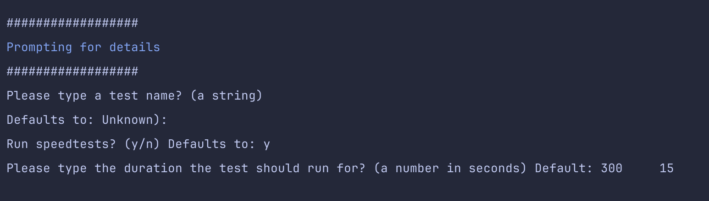

# Wifi analyzer

A program for testing the wifi-connection.

## Setup

### Step 1: .env

Correct values in `.env` (it's barely used for now).

### Step 2: Virtual environment

Run the make-target: `make setup-env` (which just runs a basic command using python3).

Then run make activate-env, to see the command you'll need to run, to activate the virtual environment: 

```
source wifianalyzerenv/bin/activate
```

... This isn't that smart/clever, but just made like this, so all setup and executing _starts_ from the Makefile.

### Step 3: Run the program

```
make run
```

Then it'll ask you some questions (which is subject to change).



## Speedtest

It uses Ookla's `speedtest-cli` library, where it'll attempt a download of a large file (like speedtest.net).

## Report

It will output something like this:


## Useful commands

```
#  Trace the dig
dig +trace google.com
```

...Is it resolving the IP in the router? 


```
# Wi-Fi info
/System/Library/PrivateFrameworks/Apple80211.framework/Versions/Current/Resources/airport -I

# Ping and traceroute
ping 8.8.8.8
traceroute 8.8.8.8
```

## Applications and tools

A list of applications I use.

### iAnalyzeWifi

Price: 59 DKK
Not worth premium. Don't buy.
Platform: Mac


### LanScan

Good for finding devices on network.
Not worth premium. Don't buy.
Platform: Mac

### Ultra Wifi

Gives a good analysis. Plus signal history! 
Premium is worth it, I'd say. But get the lifetime option.
Platform: Mac

### iWifi

Seems good. 
Seems worth Premium. 
Untried
Platform: Mac

### MTR

Platform: Mac or Linux
Has to run with sudo, like: `sudo mtr 8.8.8.8`

Free and pretty interesting.


